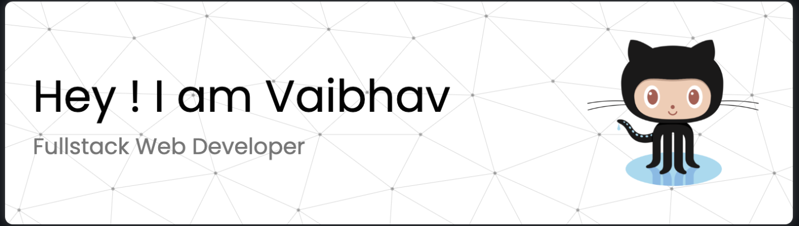

<h1 align="center">Hi 👋, I'm Vaibhav Manoj Singhvi</h1>
<h3 align="center">A passionate fullstack developer from India</h3>

I am deeply enthusiastic about crafting and advancing clean, distinctive, and elegant products. My specialization lies in constructing progressive Web Applications. I am dedicated to maintaining clean, readable, and modular code, ensuring it remains well-refactored. My passion lies in tackling intricate user interfaces, solving complex problems, and continuously optimizing website performance to achieve an excellent user experience.

* 🌍  I'm based in Udaipur, Rajasthan (INDIA)
* 🖥️  See my portfolio at [My personal website](http://vaibhavsinghvi.netlify.app)
* ✉️  You can contact me at [vaibhavsinghvi254@gmail.com](mailto:vaibhavsinghvi254@gmail.com)
* 🧠  I'm learning to build more optimized and modular code layouts
* ⚡  Get to know more about me at https://tinyurl.com/vaibhavsinghvi

### Skills

### Socials

 <a href="https://www.github.com/VAIBHAV-25" target="_blank" rel="noreferrer"> <picture> <source media="(prefers-color-scheme: dark)" srcset="https://raw.githubusercontent.com/danielcranney/readme-generator/main/public/icons/socials/github-dark.svg" /> <source media="(prefers-color-scheme: light)" srcset="https://raw.githubusercontent.com/danielcranney/readme-generator/main/public/icons/socials/github.svg" />  </picture> </a> <a href="https://www.linkedin.com/in/vaibhav-singhvi-b31333159/" target="_blank" rel="noreferrer"> <picture> <source media="(prefers-color-scheme: dark)" srcset="https://raw.githubusercontent.com/danielcranney/readme-generator/main/public/icons/socials/linkedin-dark.svg" /> <source media="(prefers-color-scheme: light)" srcset="https://raw.githubusercontent.com/danielcranney/readme-generator/main/public/icons/socials/linkedin.svg" />  </picture> </a> <a href="https://vaibhavsinghvi.netlify.app" target="_blank" rel="noreferrer"> <picture> <source media="(prefers-color-scheme: dark)" srcset="undefined" /> <source media="(prefers-color-scheme: light)" srcset="https://raw.githubusercontent.com/danielcranney/readme-generator/main/public/icons/socials/rss.svg" />  </picture> </a>

### Badges

<b>My GitHub Stats</b>

